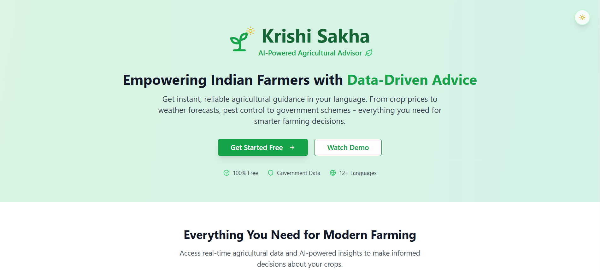
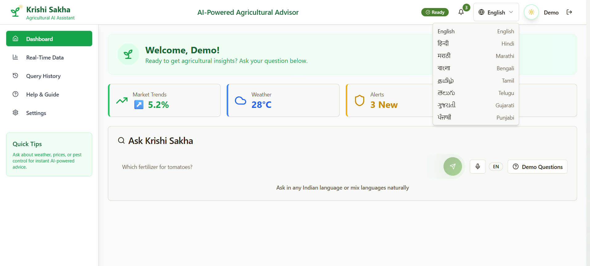
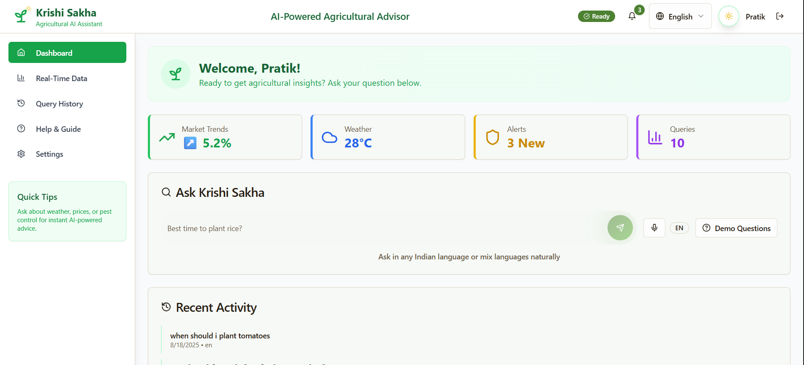
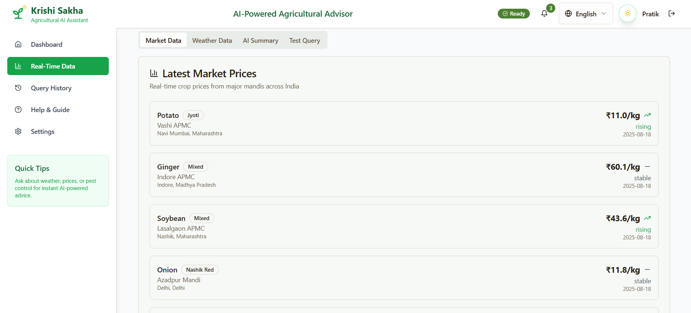

# Krishi Sakha AI

**Bharat ka Pehla Digital Kisan Dost**  
An agentic multilingual AI advisory platform empowering Indian farmers with real-time agricultural data and explainable AI-driven recommendations.

---

## Overview

Krishi Sakha AI is designed to empower Indian farmers and agri stakeholders by providing reliable, actionable, and hyperlocal agricultural guidance in their native languages via voice and text. The platform fetches real-time mandi prices, weather data, government scheme information, and pest advisories from trusted sources and leverages Google’s Gemini 2.5 Large Language Model (LLM) to generate transparent, source-cited recommendations.

The system is built for inclusivity, accessibility, and reliability, especially tailored for users in low-connectivity and multilingual rural environments.

---

## Features

- Multilingual voice and text input/output (Hindi, Bengali, Tamil, English, and more)
- Real-time mandi price tracking and hyperlocal weather updates
- Government scheme notifications and pest advisory alerts
- Explainable AI responses validated via Gemini 2.5 LLM with source citations
- Offline-first architecture with aggressive data caching
- User authentication through Google via Supabase Auth
- Robust error handling and fallback mechanisms
- Responsive UI with light/dark mode and sticky navigation
- Query history with multilingual voice/Text replay
- Animated marquee displaying live multilingual user testimonials

---

## Tech Stack

- Frontend: React.js, TypeScript, Shadcn UI, D3.js, Chart.js
- Backend: Node.js, Express, Microservices Architecture
- AI/ML: Gemini 2.5 LLM API with advanced prompt engineering
- Authentication & Storage: Supabase Auth & PostgreSQL
- Speech Processing: Google Speech-to-Text & Text-to-Speech APIs
- Deployment & DevOps: Docker, GitHub Actions, Sentry

---

## Getting Started

### Prerequisites

- Node.js (v16+ recommended)
- npm or yarn
- Supabase project with Auth and Database configured
- API keys for Gemini 2.5 LLM, OpenWeatherMap, Google Cloud Speech APIs

### Installation

1. Clone the repo:  
git clone [https://github.com/pratik-dubey/krishi-sakha.git]
cd krishi-sakha

2. Install dependencies:  
npm install

3. Create a `.env` file in the root directory with the following variables:  
NEXT_PUBLIC_SUPABASE_URL=your_supabase_url
NEXT_PUBLIC_SUPABASE_ANON_KEY=your_supabase_anon_key
GEMINI_API_KEY=your_gemini_api_key
OPENWEATHER_API_KEY=your_openweather_api_key
REACT_APP_GOOGLE_CLIENT_ID=your_google_client_id

4. Run the development server:  
npm run dev

5. Open [http://localhost:3000](http://localhost:3000) in your browser.

---

## Usage

- On the landing page, click **Get Started** and sign in using Google.

- Access multilingual feature where everyone gets response and feel of the app in their native language.

- View real-time data-backed, Gemini-validated  with govt public api hyperlocal dataset grounded by Retrieval Augmented Generation (RAG) responses with source citations.

- View Real time Mandi Prices going up and down and Weather , Humidity and much More fetched from all across india district wise with AI summary.

---

## Demo Video

Watch our full demo of Krishi Sakha AI on YouTube:  
[https://www.youtube.com/watch?v=YOUR_DEMO_VIDEO_LINK](https://www.youtube.com/watch?v=SfYYpXVYsus)

---

## Contributing

Contributions are welcome! Please open an issue or submit a pull request with improvements or bug fixes.

---

## License

This project is open-source under the [MIT License](LICENSE).

---

## Contact

Team TECH VILLAGERS  
- Pratik Dubey  
- Aryan Tripathi  

Live Demo: [https://krishi-sakha.vercel.app/](https://krishi-sakha.vercel.app/)  
Email: [pratikdubey091@example.com]

---

*Empowering every Indian farmer with AI — one query at a time.*
